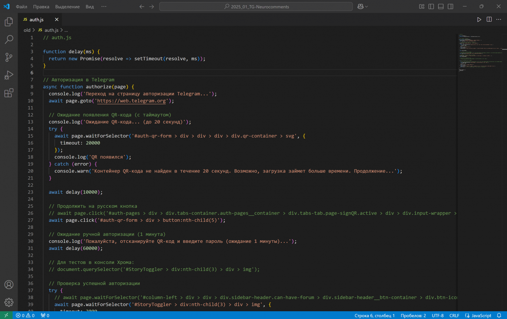
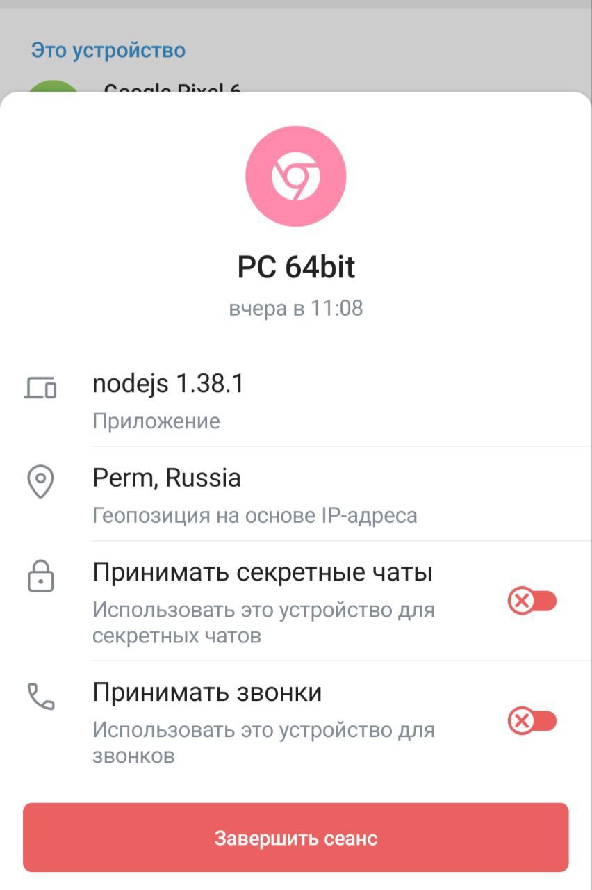
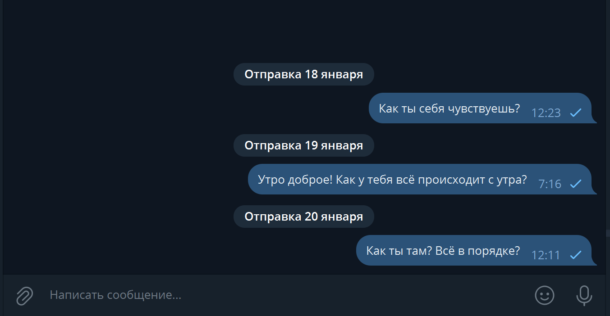

# Как автоматизировать переписку в Telegram?

### Зачем это всё?

Автоматизация позволяет отправлять заранее подготовленные, теплые и заботливые сообщения без излишнего пафоса в случайное время в заданном диапазоне. Представьте, "утро начинается не с кофе", а с вашего сообщения. Вот пример списка фраз для утреннего приветствия:

```
greetings = [
    "Доброе утро! Как ты себя чувствуешь сегодня?",
    "Привет, как настроение? Готовность к новому дню?",
    "Доброе утро! Что нового на сегодня?",
    "Утро доброе! Как у тебя всё происходит с утра?",
    "Доброе утро, как ты себя сегодня чувствуешь?",
    "Привет! Как ты, как сны?",
    "Как твои дела, готовность к этому дню?",
    "Доброе утро! Как настроение, что планируешь на день?",
    "Здравствуй! Как ты себя чувствуешь после сна?"
]
```
Даже пара теплых слов не оставит человека равнодушным, и это перейдёт уже в настоящий разговор.

Автоматизация не заменяет заботу, а помогает ее проявить, напоминая о важном человеке, даже если вы очень заняты.

### Puppeteer: почему это не лучший вариант

Изначально я пытался автоматизировать переписку через веб-версию Telegram, используя [Puppeteer](https://github.com/puppeteer/puppeteer). Идея казалась простой: скрипт заходит в Telegram, отправляет сообщения.

Был создан даже модуль авторизации через QR-код с двухфакторной аутентификацией. На практике же возникли сложности: изменения разметки веб-версии Telegram, сложности с реализацией отложенной отправки сообщений. Но для WhatsApp, например, есть подобная уже готовая [JavaScript-библиотека для автоматизации задач whatsapp-web.js](https://webjs.dev).



Этот опыт показал: не всегда нужно изобретать велосипед. Puppeteer — отличный инструмент, но в этом случае он не оправдал себя. К счастью, существует более эффективное решение — библиотека [Telethon на Python](https://github.com/LonamiWebs/Telethon).

### Telethon: находка для автоматизации

Telethon упрощает взаимодействие с Telegram. Забудьте о сложных настройках Puppeteer. Telethon — ваш личный программный ассистент.

**Как это работает?**

1. Регистрация приложения на [my.telegram.org](https://my.telegram.org/auth) для получения `api_id` и `api_hash`.

2. Авторизация своего скрипта с помощью номера телефона и кода подтверждения (если установлен).



**Преимущества Telethon:**

- Простая установка (`pip install telethon`).

- Дополнительные возможности: чтение диалогов, создание чатов и каналов, скачивание медиафайлов.

С Telethon можно создавать сценарии общения. Главное - не переусердствовать, чтобы не попасть под бан аккаунта в Telegram.

### Как избежать бана

Telegram не любит автоматизацию и тщательно следит за подозрительной активностью. Поэтому, если вы не хотите потерять доступ к своему аккаунту, нужно быть предельно аккуратным.

Чего точно не стоит делать? Массовая рассылка одинаковых сообщений. Но вам это не понадобится, ведь цель скрипта — общение с одним человеком, а не спам. Как обезопасить себя? Используйте скрипт только для личного общения. Это уменьшает риск привлечь внимание системы.




Результат работы скрипта

Соблюдайте [лимиты API, описанные в статье на Хабре](https://habr.com/ru/companies/tensor/articles/799565/). Например, не отправляйте больше 10 медиасообщений за 5 минут - даже с лёгкой анимацией это вызовет ошибку.

### Скрипт: первая версия

```python
# pip install telethon python-dotenv pytz

import asyncio
from telethon import TelegramClient
from datetime import datetime, timedelta, time
import random
import pytz
from dotenv import load_dotenv
import os

# Загрузка конфигурации
load_dotenv()
api_id = os.getenv("api_id")
api_hash = os.getenv("api_hash")
session_name = 'session_name'

# Таймзона и сообщения
ekb_timezone = pytz.timezone('Asia/Yekaterinburg')
messages = ["Доброе утро! Как твои дела?", "Привет! Надеюсь, у тебя всё отлично!"]

async def schedule_messages(client, user, messages, days):
    for day in range(days):
        send_time = ekb_timezone.localize(
            datetime.combine(datetime.now().date() + timedelta(days=day + 1), 
                             time(random.randint(8, 10), random.randint(0, 59)))
        )
        message = random.choice(messages)
        await client.send_message(user, message, schedule=send_time.astimezone(pytz.UTC))
        print(f"Сообщение запланировано: {message} на {send_time}")

async def main():
    client = TelegramClient(session_name, api_id, api_hash)
    await client.start()
    user = await client.get_entity("USERNAME")
    await schedule_messages(client, user, messages, 7)
    await client.disconnect()

asyncio.run(main())
```


**Подготовка**:

1. Установите необходимые библиотеки: `pip install telethon python-dotenv pytz`.

2. Создайте файл `.env` и добавьте туда `api_id` и `api_hash`, полученные на [my.telegram.org](https://my.telegram.org/auth).

3. Замените `USERNAME` на имя пользователя или номер телефона.

### Полная версия скрипта

Полная версия скрипта автоматизации своей переписки с девушкой в Telegram представлена ниже. Скрипт подключается к аккаунту через API, загружает данные аутентификации из `.env`, и планирует отправку случайных сообщений (утренних и дневных) для заданных пользователей в определённое время:
```python
# pip install telethon python-dotenv pytz

import sys
sys.stdout.reconfigure(encoding='utf-8')

import asyncio
from telethon import TelegramClient, utils
from datetime import datetime, timedelta, time
import random
from dotenv import load_dotenv
import os
import pytz

# Загрузка переменных окружения из .env
load_dotenv()
api_id = os.getenv("api_id")  # Ваш API ID
api_hash = os.getenv("api_hash")  # Ваш API Hash
session_name = 'nodejs_session'  # Название сессии

greetings = [
    "Доброе утро! Как ты себя чувствуешь сегодня?",
    "Привет, как настроение? Готовность к новому дню?",
    "Доброе утро! Что нового на сегодня?",
    "Утро доброе! Как у тебя всё происходит с утра?",
    "Доброе утро, как ты себя сегодня чувствуешь?",
    "Привет! Как ты, как сны?",
    "Как твои дела, готовность к этому дню?",
    "Доброе утро! Как настроение, что планируешь на день?",
    "Здравствуй! Как ты себя чувствуешь после сна?"
]
supportive_messages = [
    "Как ты там? Всё в порядке?",
    "Как проходит твой день?",
    "Надеюсь, день не слишком утомительный для тебя!",
    "Как настроение? Всё ли хорошо?",
    "Не забывай делать перерывы, если устала!",
    "Как ты? Чем занимаешься сейчас?",
    "Если что-то нужно, не стесняйся мне писать.",
    "Надеюсь, день приносит тебе только положительные моменты!",
    "Как ты себя чувствуешь? Хочешь поговорить?"
]

# Таймзона Екатеринбурга
ekb_timezone = pytz.timezone('Asia/Yekaterinburg')

async def schedule_messages(client, user, messages, start_hour, end_hour, days, description):
    """Планирует сообщения для заданного пользователя на несколько дней."""
    for day in range(days):
        # Вычисляем дату и время в Екатеринбурге
        now_ekb = datetime.now(ekb_timezone)
        schedule_date_ekb = now_ekb.date() + timedelta(days=day + 1)
        schedule_time_ekb = ekb_timezone.localize(datetime.combine(schedule_date_ekb, time(hour=random.randint(start_hour, end_hour), minute=random.randint(0, 30))))

        # Конвертируем время в UTC для Telethon
        schedule_time_utc = schedule_time_ekb.astimezone(pytz.UTC)

        message_text = random.choice(messages)

        try:
            await client.send_message(user, message_text, schedule=schedule_time_utc)
            print(f"✅ Отложенное сообщение отправлено для {description} на {schedule_time_ekb.strftime('%Y-%m-%d %H:%M:%S')}")
        except Exception as e:
            print(f"❌ Ошибка при отправке сообщения для {description}: {e}")


async def main():
    client = TelegramClient(session_name, api_id, api_hash)
    await client.start()

    print("🚀 Запуск программы...")
    try:
        tasks = []

        user_Name1 = await client.get_entity("empenoso") # имя пользователя
        tasks.append(schedule_messages(client, user_Name1, greetings, 7, 7, 3, "пользователя userName"))  # Утренние сообщения
        tasks.append(schedule_messages(client, user_Name1, supportive_messages, 12, 12, 3, "пользователя userName"))  # Дневные сообщения

        user_Name2 = await client.get_input_entity("+7912XXXXX")  # Непосредственно номер телефона
        tasks.append(schedule_messages(client, user_Name2, greetings, 7, 7, 3, "пользователя +7912XXXXX"))  # Утренние сообщения

        await asyncio.gather(*tasks)
        print("🎉 Все сообщения успешно настроены.")
    except Exception as e:
        print(f"❌ Ошибка: {e}")
    finally:
        await client.disconnect()
        print("🔌 Соединение с Telegram завершено.")


if __name__ == '__main__':
    asyncio.run(main())
```
### Заключение

Данная автоматизация — инструмент для выражения эмоций. Скрипт не заменит живое общение, но поможет не забыть проявить внимание. Отложенные сообщения — это лишь начало. Не переставайте общаться лично. Автоматизируйте с душой, искренностью и чувством меры!
